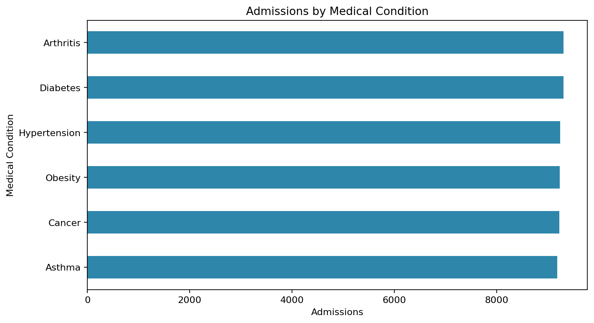
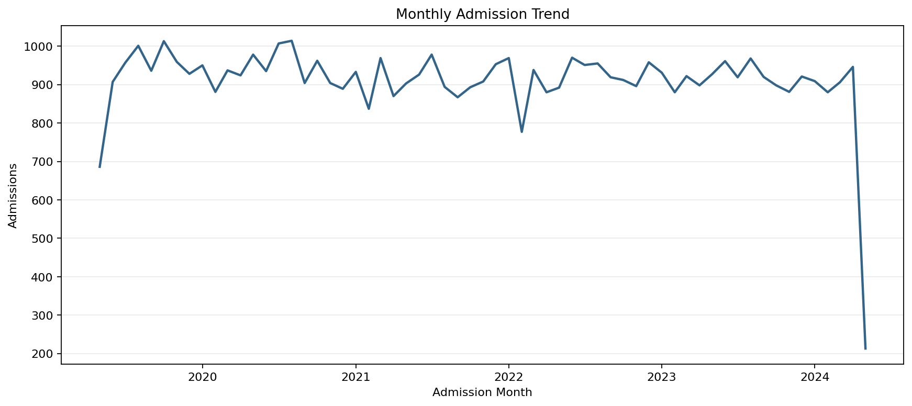
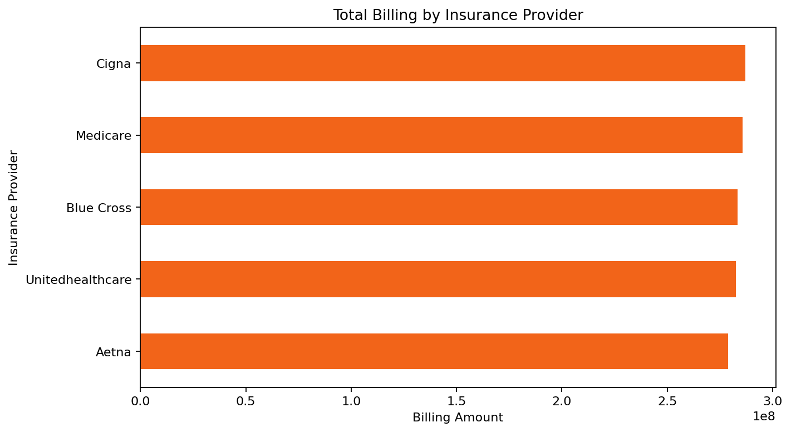
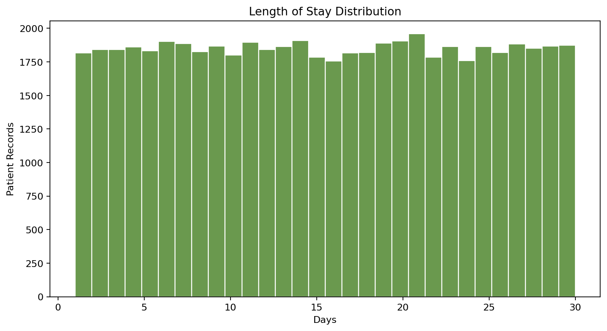

# MediPulse - Healthcare Operations Intelligence

MediPulse is an end-to-end healthcare analytics portfolio project. It turns raw hospital encounter data into cleaned reporting data, operational KPIs, SQL analytics, visual outputs, and a Power BI dashboard plan.

## Project Summary

This project analyzes 55,500 healthcare encounters to understand patient volume, billing performance, length of stay, emergency demand, abnormal test results, and operational data quality.

## Key KPIs

| Metric | Value |
| --- | ---: |
| Total Patients | 55,500 |
| Unique Hospitals | 39,876 |
| Unique Doctors | 40,341 |
| Total Billing | $1.42B |
| Average Billing | $25,540.29 |
| Median Billing | $25,538.07 |
| Average Length of Stay | 15.51 days |
| Emergency Admission Rate | 32.92% |
| Abnormal Test Rate | 33.56% |
| Repeat Visit Proxy Rate | 14.64% |
| Negative Billing Records Flagged | 108 |

## Tech Stack

- Python
- Pandas
- NumPy
- Matplotlib
- SQL
- Power BI

## Project Structure

```text
MediPulse-Healthcare-Operations-Intelligence/
|-- data/
|   |-- raw/
|   |-- cleaned/
|   `-- external/
|-- docs/
|-- images/
|-- notebooks/
|-- output/
|-- powerbi/
|-- sql/
|-- src/
|-- analysis.py
|-- app.py
|-- requirements.txt
`-- README.md
```

## Dataset

Raw file: `data/raw/healthcare_dataset.csv`

The dataset contains 55,500 rows and 15 columns:

- Name
- Age
- Gender
- Blood Type
- Medical Condition
- Date of Admission
- Doctor
- Hospital
- Insurance Provider
- Billing Amount
- Room Number
- Admission Type
- Discharge Date
- Medication
- Test Results

## Feature Engineering

The pipeline creates:

- Standardized snake_case fields
- Cleaned patient, hospital, and doctor names
- Admission and discharge date fields
- Length of stay
- Admission year, month, quarter, and weekday
- Age group
- Stay category
- Billing per day
- Emergency admission flag
- Abnormal test result flag
- Repeat visit proxy
- Negative billing audit flag
- Patient complexity score and segment

## Visual Analysis

### Admissions by Condition



### Monthly Admission Trend



### Billing by Insurance Provider



### Length of Stay Distribution



## How to Run

Install dependencies:

```powershell
pip install -r requirements.txt
```

Run the full analytics pipeline:

```powershell
python analysis.py
```

Run a quick console KPI summary:

```powershell
python app.py
```

## Outputs

After running `analysis.py`, the project generates:

- `data/cleaned/healthcare_cleaned.csv`
- `data/cleaned/kpi_summary.csv`
- `data/cleaned/condition_summary.csv`
- `data/cleaned/hospital_summary_top25.csv`
- `data/cleaned/monthly_trend.csv`
- `data/cleaned/patient_risk_scores.csv`
- `images/admissions_by_condition.png`
- `images/monthly_admission_trend.png`
- `images/billing_by_insurer.png`
- `images/length_of_stay_distribution.png`

## SQL Analytics

SQL files are stored in `sql/`:

- `01_create_tables.sql`: reporting table definition
- `02_business_questions.sql`: KPI and business question queries

## Power BI Dashboard

Power BI implementation notes and DAX measures are in:

- `powerbi/dashboard_spec.md`

A step-by-step PDF guide is available at:

- `output/pdf/MediPulse_PowerBI_Step_by_Step_Guide.pdf`

Recommended dashboard pages:

- Executive Overview
- Operations
- Financial Performance
- Clinical Signals

## Executive Report

The executive summary is available at:

- `docs/executive_report.md`

## Portfolio Highlights

This project demonstrates practical data analyst skills across data cleaning, feature engineering, KPI design, SQL analytics, dashboard planning, predictive-style segmentation, and executive communication.
